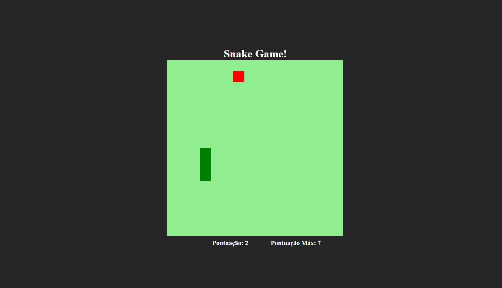

# Jogo da Cobrinha

Jogo da Cobrinha feito com **HTML**, **CSS** e **JavaScript**. Para testar é só baixar os arquivos e abrir em um navegador!

## Comandos
- **Setinhas do teclado:** Move a Cobra pro lado selecionado.

- **Espaço:** Ativa e desativa a pausa do jogo.

Coisas que ainda serão feitas.

- [x] Arrumar Botão de tema.
- [x] Adicionar Pausa.
- [ ] Adicionar Vitória caso cubra a tela inteira.
- [x] Pontuação Máxima salva no navegador.
- [x] Refatoração do código.
- [ ] Responsividade para o celular.